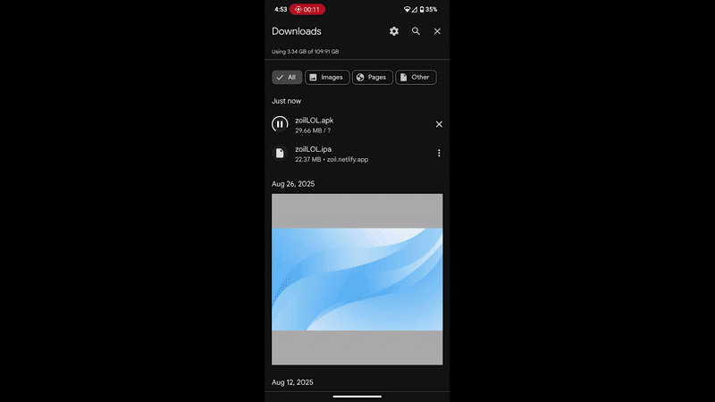

# Zoil Soundboard App

# visit here to download the app
**https://zoil.netlify.app**

## Features

- **24 Soundboard Buttons**: epic and cool colors and fonts !
- **Audio Playback**: Spam it as much as u like !
- **Dynamic Layout**: tried to get to work on all screen sizes
- **Customization** Arrange the sound layout !

## Source code location
Main Functionility and source code is in the lib Folder, with minor tweaks in android for background and icon display

## Compile it yourself on android

cd into the main directory

1. have Flutter installed and configured
2. create a new folder and cd into it
3. in terminal run `flutter create lol`
4. Remove the test folder or some
5. overwrite the project with this code
6. Run `flutter pub get` to install dependencies or save the pubspec.yaml
7. Compile it to apk run `flutter build apk --release`
8. or you can run in a simulator if insalled

## Compile it yourself on iOS 

1. Its actually SOO much effort that first you need a macOS device with xcode installed and a apple dev account and need to verify and sign the package before compiling it in the runner folder you open it with xcode for the signing app proccess and all this other stuff if you care enough look it up fr.

**Its in a cross platform language so it can run on anything but it looks better on phone screens**

## iOS installation

have altserver running well device plugged in well installing the IPA

for EU you can download the altstore quickly here
https://altstore.io/download

If not in EU installing altstore takes more steps with PC
https://altstore.io/#Downloads

its pretty easy you just need to sign in your apple id a couple times on pc and have device plugged into pc.
altstore Needs iTunes and iCloud to work

once Altstore is installed on device sideload the zoilLOL.ipa file and it should work

Altstore apps are not permanent IF not in the EU, this app was made for fun and the biggest twitch streamer EVER and wasnt meant for everyday use anyways

## Android installation

install the zoilLOL.apk file with a default package manager

